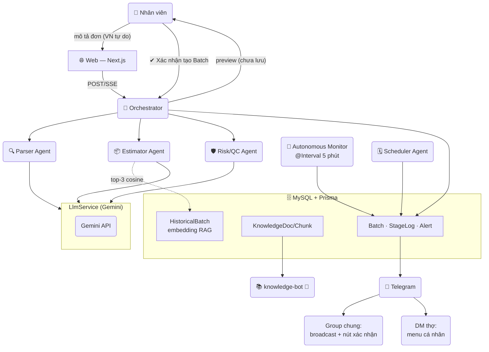

**Demo trực tuyến:** 👉 **https://task.tansang.dpdns.org/**

> Kính gửi quý anh/chị evaluator,
>
> Em là Nguyễn Lưu Tấn Sang, ứng tuyển vị trí **Software Engineer Fresher** tại Gốm Thủ Đức.
> Hệ thống bên dưới là bài tự làm của em — **Đề 2: Hệ thống Điều phối & Giám sát Quy trình Xưởng Gốm**.
>
> 🏗️ **Kiến trúc**: 5 AI Agents (Parser, Estimator, Risk/QC, Scheduler, Knowledge) + 1 Orchestrator, Monorepo NestJS + Next.js, MySQL, Telegram Bot

---

# 🏺 Kilnflow — Hệ thống Điều phối & Giám sát Xưởng Gốm bằng AI

> **Đề bài 2 — Ceramics Manufacturing Pipeline**: AI phân tích đơn hàng gốm · Điều phối quy trình sản xuất đa bước · Cảnh báo sự cố/tiến độ qua Telegram · Dashboard Kanban realtime


---

## 🎯 Bài toán

Một xưởng gốm tiếp nhận đơn hàng dưới dạng **mô tả tự do tiếng Việt**:

> *"Đơn 200 Bình gốm họa tiết sen men lam cao 35cm, yêu cầu nung nhiệt độ cao 1280°C, hoàn thành trong 10 ngày"*

Kilnflow tự động hóa toàn bộ phía sau:

```
Mô tả đơn ──▶ AI bóc tách thông số ──▶ Người dùng xác nhận ──▶ Mẻ vào quy trình 7 công đoạn
                                                                        │
              Telegram (group + DM từng thợ) ◀── cảnh báo/tiến độ ◀──────┘
```

**Nguyên tắc thiết kế cốt lõi:** AI output chỉ là *đề xuất* — luôn đi qua validation (Zod), luôn có con người xác nhận trước khi thành dữ liệu sản xuất, và mọi luồng đều có fallback khi LLM lỗi.

---

## ✨ Tính năng nổi bật

### 🤖 Multi-agent Pipeline (1 Orchestrator + 5 Agents)
| Agent | Vai trò | Điểm nhấn kỹ thuật |
|---|---|---|
| 🔍 **Parser** | Mô tả tự do → JSON chuẩn 12 trường | Few-shot prompt + Zod strict + **self-correction loop tối đa 2 lần**, fail thì trả lỗi rõ ràng |
| 📦 **Estimator** | Ước lượng đất sét & giờ nung | **RAG trên mẻ lịch sử thật**: embedding Gemini → top-3 cosine similarity → trung bình có trọng số; cold-start tự rơi về công thức |
| 🛡️ **Risk/QC** | Rà soát trước sản xuất + phân loại lỗi QC | Ngưỡng phân loại **tính trong code** (>15% critical…), LLM chỉ soạn lời nhắn; check men↔nhiệt độ, deadline↔backlog, clay↔lịch sử |
| 🗓️ **Scheduler** | Xếp mẻ vào lò theo ưu tiên/deadline/capacity | LLM đề xuất → Zod validate → **sanity-check trong code** → fallback thuật toán tham lam deterministic |
| 📚 **Knowledge** | Chatbot tri thức gốm sứ | RAG trên tài liệu nội bộ, trích dẫn `[Nguồn N]` kèm URL, từ chối khi thiếu dữ liệu |
| 🧭 **Orchestrator** | Điều phối Parser → Estimator → Risk | Không tự xử lý nghiệp vụ; phát **reasoning trace trực tiếp qua SSE** |

### 🏭 Quy trình sản xuất
- State machine 7 công đoạn `Tạo hình → Phơi & Tỉa → Vẽ → Tráng men → Nung → QC & Đóng gói → Hoàn thành`
- Chỉ tiến **đúng 1 bước**, cập nhật qua Web **hoặc nút bấm Telegram**
- ⏱️ **Autonomous Monitor** quét mỗi 5 phút: mẻ quá hạn công đoạn >30% → tự động cảnh báo không cần ai nhắc

### 💬 Telegram — vượt mức điểm cộng của đề
- 📢 **Group chung**: batch mới, chuyển công đoạn, cảnh báo QC đỏ, trễ tiến độ, kết quả xếp lò
- ✅ **Nút bấm inline** "[Xác nhận hoàn thành bước này]" ngay trong group — chặn **double-advance bằng conditional UPDATE nguyên tử** ở mức DB
- 👤 **Menu cá nhân qua DM** cho từng thợ (persistent keyboard): chọn công đoạn phụ trách → xem mẻ của mình → hoàn thành/báo lỗi riêng tư, group vẫn nhận broadcast
- 🛠 `/baocao`: chọn mẻ → chọn mức độ 🟢🟡🔴 → mô tả tự do → tạo Alert (state lưu DB, hết hạn 5 phút, sống sót qua restart)
- 🔐 Bảo mật: chỉ chat đã cấu hình được điều khiển; thợ phải nằm trong bảng `AuthorizedWorker`

### 🖥 Dashboard Kanban
KPI tổng quan · Kanban 7 cột realtime (poll 10s) · **Sơ đồ 3 agent sáng lên trực tiếp** khi xử lý đơn (qua SSE trace) · Form báo QC · Feed cảnh báo · Chatbot tri thức dạng cửa sổ nổi 💬

---

## 🏗️ Kiến trúc



> Chi tiết kiến trúc từng agent & lý do thiết kế: xem [docs/demo-script.md](docs/demo-script.md) và phần Agents ở trên.

---

## 🚀 Chạy dự án

### Cách 1 — Docker Compose (khuyên dùng, 1 lệnh)

```bash
git clone https://github.com/sangvirgo/kilnflow.git && cd kilnflow
cp .env.example .env          # điền key theo bảng dưới
docker compose up -d --build  # MySQL + tự db push + tự seed + tự ingest + start
```

→ Web: **http://localhost:3000** · API: http://localhost:3001

Container API tự động: chờ MySQL → `prisma db push` → seed 12 mẻ lịch sử (embedding thật) → ingest knowledge-base → khởi động.

### Biến môi trường (`​.env`)

| Biến | Bắt buộc | Mô tả |
|---|---|---|
| `GEMINI_API_KEY` | ✅ để dùng AI thật | Không có → hệ thống chạy đủ pipeline ở chế độ Mock (deterministic) |
| `TELEGRAM_BOT_TOKEN` / `TELEGRAM_CHAT_ID` | ⭕ | Thiếu → thông báo chỉ ghi log, luồng chính vẫn chạy |
| `DATABASE_URL` | ✅ | Compose tự đặt sẵn (`mysql://root@mysql:3306/kilnflow`) |
| `EMBEDDING_PROVIDER` | ⭕ | `auto` (Gemini) \| `local` — local fallback tự kích hoạt khi API lỗi |
| `MONITOR_INTERVAL_MS` | ⭕ | Chu kỳ monitor (mặc định 300000 = 5 phút) |
| `TELEGRAM_LISTEN` | ⭕ | `false` khi chạy 2 bản API song song (tránh xung đột polling) |

### Cách 2 — Chạy local không Docker

```bash
npm install
npm run build:shared
cd apps/api && npx prisma db push && npm run seed && npm run start:dev   # terminal 1
cd apps/web && npm run dev                                                # terminal 2
```

---

## 💬 Thiết lập Telegram Bot

```bash
# 1. Tạo bot: chat @BotFather → /newbot → lấy TELEGRAM_BOT_TOKEN
# 2. Lấy chat_id nhóm: thêm bot vào group, gửi 1 tin, mở
#    https://api.telegram.org/bot<TOKEN>/getUpdates → đọc chat.id
# 3. Cấp quyền cho thợ (DM riêng với bot):
npm run worker:add -- --id=<telegramUserId> --name="Anh Ba"
```

Sau đó trong DM bot: `/start` → bàn phím cố định **🧑‍🏭 Công đoạn · 📦 Mẻ tôi đang làm · ⚠️ Báo lỗi**.
Trong group: mọi thông báo stage đều kèm nút **✅ Xác nhận hoàn thành bước này** (chống double-advance ở mức SQL).

### 🤖 Bot tương tác — chi tiết (Phase 8 / 8.6 / 8.7)

| Luồng | Cách hoạt động |
|---|---|
| ✅ Nút xác nhận trong group | Mỗi thông báo chuyển stage kèm nút; bấm → đối chiếu `currentStage` trong DB (chống double-advance bằng conditional UPDATE nguyên tử), sửa message gốc ghi tên người xác nhận |
| ⚠️ `/baocao` báo lỗi | Chọn mẻ → chọn mức độ 🟢🟡🔴 → mô tả tự do → tạo Alert. State lưu bảng `PendingReport` (TTL 5 phút, không mất khi restart) |
| 👤 DM menu cá nhân | Thợ (đã cấp quyền qua `worker:add`) nhắn riêng bot: chọn công đoạn phụ trách → bot **tự ping khi có mẻ mới đổ về đúng công đoạn đó** kèm nút nhận mẻ |
| 🙋 Nhận mẻ | Ghi nhận người phụ trách trên Batch, danh sách hiện badge 👤, cho phép nhận đè có cảnh báo |
| 🔐 Bảo mật | Chỉ chat đã cấu hình được điều khiển; người lạ DM bị chặn kèm hướng dẫn ID |

---

## 🔌 API chính

| Method | Endpoint | Mô tả |
|---|---|---|
| `POST` | `/orders/parse` | Chạy Parser + Estimator + Risk, trả preview trực tiếp |
| `GET` | `/orders/parse/stream?text=` | **SSE** reasoning trace Parser → Estimator → Risk, trả preview (không lưu) |
| `POST` | `/orders/confirm` | Human-in-the-loop: persist Order + Batch + stageEstimates sau khi duyệt |
| `GET` | `/batches` | Danh sách mẻ cho Kanban (kèm progress từng công đoạn từ AI) |
| `PATCH` | `/batches/:id/stage` | Tiến 1 công đoạn (atomic, chống double-advance) |
| `PATCH` | `/batches/:id/actuals` | Ghi nhận số liệu thực tế (đất/giờ/men thật) → archive RAG |
| `POST` | `/batches/:id/qc-report` | Báo lỗi QC → phân loại ngưỡng trong code → Alert + Telegram |
| `POST` | `/scheduler/run` | Chạy Scheduler Agent (LLM + fallback greedy) |
| `GET` | `/alerts` | Feed cảnh báo |
| `POST` | `/knowledge/ask` | RAG Q&A kèm nguồn |
| `GET` | `/cms/content` | Nội dung landing page (public) |
| `PUT` | `/cms/content` | Cập nhật nội dung landing (cần header `x-cms-token`) |
| `POST` | `/monitor/tick` | Kích hoạt monitor thủ công (demo) |
| `POST` | `/telegram/test/*` | Giả lập nút/tin nhắn Telegram cho kiểm thử tự động |

## 🧪 Kiểm thử

```bash
npm run test:retry-loop                       # Parser self-correction: 4/4 scenario
cd apps/api
npx tsx src/scripts/test-phase8.ts            # Telegram group: race, expiry, security — 20 checks
npx tsx src/scripts/test-phase86.ts           # DM menu, ping arrival, claim — 36 checks
npx tsx src/scripts/test-stage-estimates.ts   # Per-stage duration RAG/cold-start/legacy — 12 checks
npx tsx src/scripts/test-feedback-loop.ts     # Actuals → archive DONE → RAG learns — 11 checks
```

## 📁 Cấu trúc

```
kilnflow/
├── apps/
│   ├── api/                        # NestJS — toàn bộ nghiệp vụ
│   │   ├── src/agents/             # parser · estimator · risk-qc · scheduler · orchestrator
│   │   ├── src/telegram/           # service + listener (inline button, DM menu, arrival ping)
│   │   ├── src/cms/                # CMS controller/service (landing page content)
│   │   ├── src/common/             # stage-duration.config (nguồn chung Monitor + UI)
│   │   ├── src/{orders,batches,scheduler,knowledge,monitor,llm,embeddings,prisma,config}/
│   │   ├── prisma/                # schema 11 models + seed + entrypoint.sh
│   │   └── src/scripts/           # test suites + worker-add CLI
│   └── web/                        # Next.js App Router + Tailwind (Landing, Kanban, Order, CMS, Knowledge chat)
├── packages/shared-types/          # DTO + Zod schema dùng chung 2 app
├── knowledge-base/                 # 9 tài liệu gốm sứ (.md) cho RAG
├── docs/
│   ├── demo-script.md              # Kịch bản quay video demo
│   └── slides-rag.html             # Slide giới thiệu RAG (7 slides, phím ←/→)
├── docker-compose.yml              # mysql + api + web (restart: always)
└── .env.example                    # Biến môi trường mẫu
```

## 🌐 Deploy sau nginx (production-lite)

nginx lắng nghe **cổng 80** duy nhất: `/` → web:3000, `/api/` → api:3001 (SSE: `proxy_buffering off`, timeout dài). Không cần mở port ứng dụng ra ngoài. Xem cấu hình trong lịch sử deploy hoặc liên hệ repo owner.

---

Made with ☕ + AI vibecoding — Gemini điều phối, con người vẫn giữ tay phanh. 🏺
